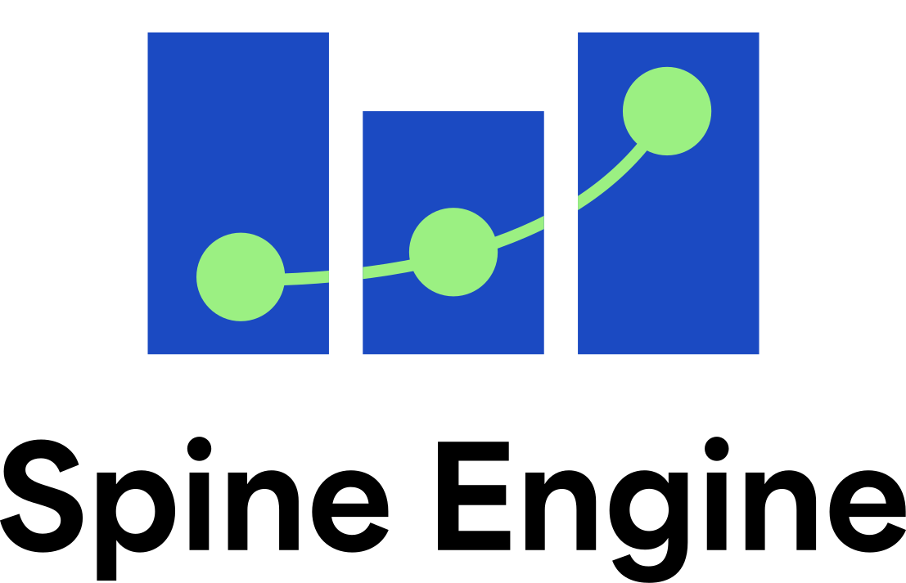

# Spine Engine

A Python package to coordinate the execution of [Spine Toolbox](https://github.com/spine-tools/Spine-Toolbox) workflows.

  <picture>
    <source media="(prefers-color-scheme: dark)" srcset="./fig/spineengine_logo.svg" width="50%">
    
  </picture>

## License

Spine Engine is released under the GNU Lesser General Public License (LGPL) license. All accompanying
documentation and manual are released under the [Creative Commons BY-SA 4.0 license](https://creativecommons.org/licenses/by-sa/4.0/).

## Getting started

### Installation

To install Spine Engine into an existing Python environment, run

    $ pip install spine_engine

<table width=500px frame="none" style="margin-left:auto;margin-right:auto">
<tr>
<td valign="middle" width=100px>
</td>
<td valign="middle">This project has received funding from European Climate, Infrastructure and Environment Executive Agency under the European Union’s HORIZON Research and Innovation Actions under grant agreement N°101095998.</td>
<tr>
<td valign="middle" width=100px>
</td>
<td valign="middle">This project has received funding from the European Union’s Horizon 2020 research and innovation programme under grant agreement No 774629.</td>
</table>
